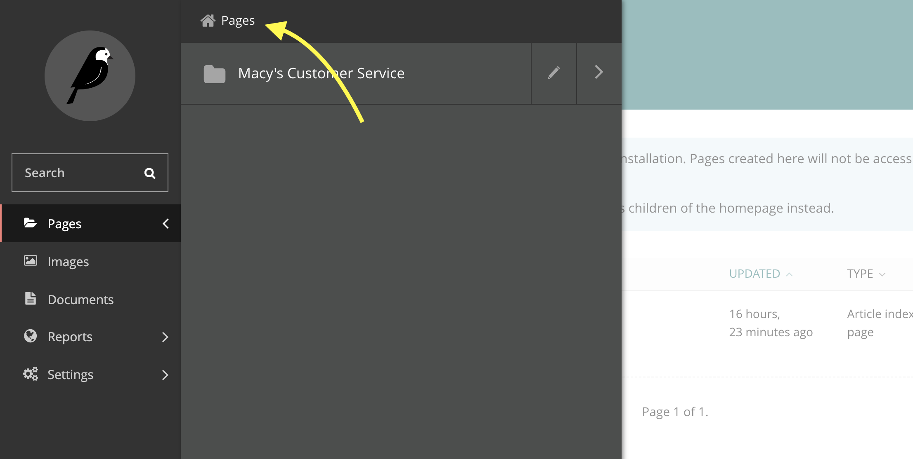

# external_cms_backend

# Installing
1. Make sure you have python 3.8+ installed
`python3 --version`

2. Create a virtualenv
`python3 -m venv venv`

3. Activate the virtualenv
`source venv/bin/activate`

4. Install dependencies
`pip install -r requirements.txt`

__Note: the database is currently a SQLite DB that is not in git__

5. Create a local database
`./manage.py migrate`

6. Create an admin user
`./manage.py createsuperuser`

# Dealing with merged in changes
If you merge from a branch (typically master) your local database may have migrations that have not been applied. One option is to delete the database and start over. The other is to apply the migrations to your local database.
`./manage.py migrate`

# Running locally
1. Activate the virtualenv
`source venv/bin/activate`

2. Start the Wagtail server on port 8000
`./manage.py runserver`

3. Visit the admin dashboard
[Admin Dashboard](http://127.0.0.1:8000)

# Using
1. Go to the root

2. Create a child page (Add Child Page) that will serve as the main page for the site. Select the type "Article Index Page". Optionally name it "Macy's Customer Service"

3. In the left sidebar, go to _Settings_->_Sites_. Create a site (or modify the existing site) so that the default site's root page is the Article Index Page you just created.

# Viewing the database contents
1. Download [DB Browser for SQLite](https://sqlitebrowser.org)

2. Open the file `external_cms_backend/db.sqlite3`.

